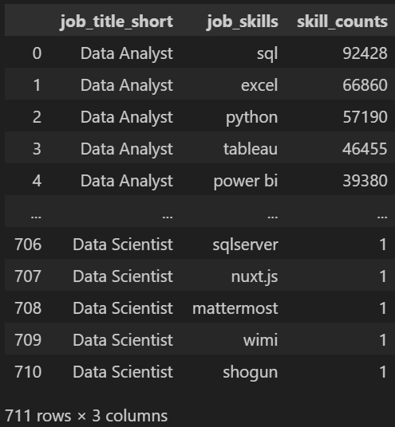
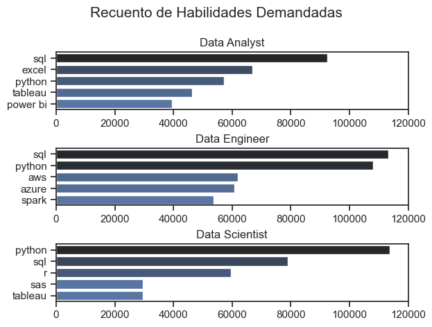

# 2. ¿Cuáles son las habilidades más demandadas para los 3 puestos de datos más populares?

Para acceder al documento con el código, [clicar aquí](2_Skill_Demant.ipynb)

En el primer informe vimos que los tres puestos más populares son Data Analyst, Data Engineer y Data Scientist. Estos puestos solicitan diversas habilidades, y sería interesante saber las que más.


Definimos la variable `top_roles` para conocer, en formato lista, los tres roles más populares. Filtramos el DataFrame para que solo aparezcan datos correspondientes a estos tres roles.

```
top_roles = df["job_title_short"].value_counts().head(3).index.tolist()

df = df[df["job_title_short"].isin(top_roles)]
```
En nuestra base de datos, la columna `job_skills` contiene listas a modo de input, así que para cada `job_title_short` hay una lista asociada con las habilidades solicitadas. Por ello, y para facilitar el tratamiento de esta columna, usaremos el método `explode` para transformar estas listas en filas independientes para cada rol y habilidad, y `ast.literal_eval` para eliminar las filas vacías.
```
df["job_skills"] = df["job_skills"].apply(lambda x: ast.literal_eval(x) if pd.notna(x) else x)
df = df.explode("job_skills")
```
Nos interesa conocer, para cada rol, las habilidades que requiere y el número de veces que la requiere. 
```
df_grouped = df.groupby("job_title_short")["job_skills"].value_counts().reset_index(name="skill_counts")
```





Usamos `seaborn` para representar graficamente el DataFrame. Con tal de que solo aparezcan las 5 habilidades con más valores para cada rol, haremos un bucle `for` sobre la columna `job_title_short` y especificaremos `head(5)`. Nos aseguramos que salgan las habilidades con mayor recuento, en vez de las que menos, con `[::-1]`. 

```
fig, ax = plt.subplots(len(top_roles), 1)

sns.set_theme(style='ticks')

for i, job_title in enumerate(top_roles):
    df_plot = df_grouped[df_grouped['job_title_short'] == job_title].head(5)[::-1]

    sns.barplot(data=df_plot, x='skill_counts', y='job_skills', ax=ax[i], hue='skill_counts', palette='dark:b_r')
    ax[i].set_title(job_title)
    ax[i].invert_yaxis()
    ax[i].set_ylabel('')
    ax[i].set_xlabel('')
    ax[i].get_legend().remove()
    ax[i].set_xlim(0, 120000) 

fig.suptitle('Recuento de Habilidades Demandadas', fontsize=15)
fig.tight_layout(h_pad=0.5) 
plt.show()
```



Observamos que SQL y Python destacan sobre el resto de habilidades. Para los tres roles, la capacidad de extraer y manipular datos es cardinal, así como tener un motor técnico de apoyo. Vemos también que conocimientos en herramientas de visualización de datos y hojas de cálculo son muy valoradas en Data Analyst y Data Scientist, ya que se trata de roles con una importante vertiente en comunicación de resultados. Por su parte, los roles de Data Engineer destacan por pedir herramientas como AWS, Azure o Spark, más orientadas a la infraestructura, el procesamiento escalable y el almacenamiento de datos en la nube.


