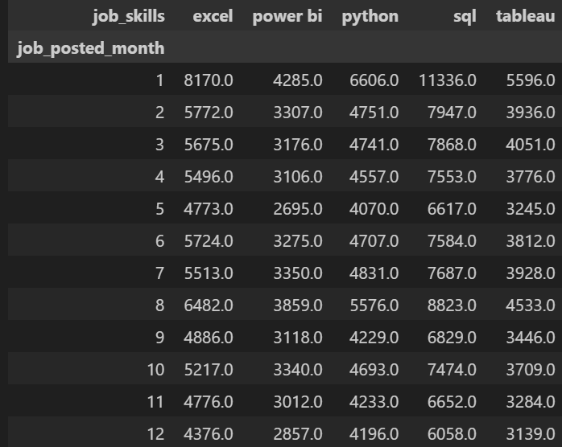
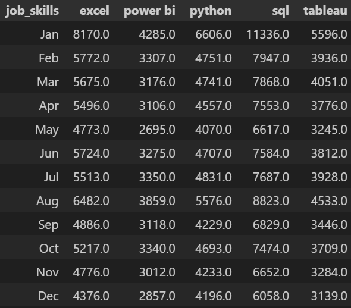
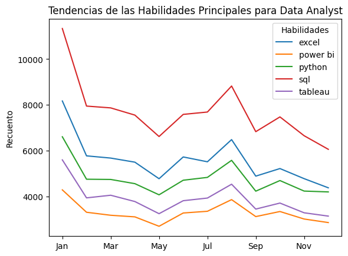

# 3. ¿Cuál es la tendencia de las 5 habilidades más demandadas para los analistas de datos?

Para acceder al documento con el código, [clicar aquí](P2.ipynb)

Importamos las librerías habituales, filtramos por Data Analyst y usamos `explode` sobre nuestro DataFrame.

```
dataset = load_dataset("lukebarousse/data_jobs")
df = dataset["train"].to_pandas()
df["job_skills"] = df["job_skills"].apply(lambda x: ast.literal_eval(x) if pd.notna(x) else x)

df = df[df["job_title_short"] == "Data Analyst"]
df_exploded = df.explode("job_skills")
```

Para estudiar la tendencia anual de las cinco habilidades más demandadas es necesario hacer una limpieza técnica en la columna `job_posted_date`. Vemos que, para cada oferta, esta columna nos indica la fecha y la hora en que fue publicada, pero se trata de una cadena de texto. Para que Python la reconozca como una medida de tiempo, usamos `pd.to_datetime()`  sobre dicha columna, con lo cual tendremos un objeto `datetime64[ns]` que nos facilitará el análisis mes a mes. 


```
df["job_posted_date"] = pd.to_datetime(df["job_posted_date"])
```


Aclarar que de ahora en adelante, y siempre que sea necesario, usaremos esta técnica sin necesidad de comentarla explícitamente. 

Creamos una nueva columna, `job_posted_month`, que nos indique solamente el mes (1-12) de publicación de cada oferta. Definimos `top_5_skills` como una lista con las 5 habilidades con mayor recuento. Agrupamos recuento de habilidades y meses en una `pivot_table`. 

```
df_exploded["job_posted_month"] = df_exploded["job_posted_date"].dt.month
top_5= df_exploded["job_skills"].value_counts().head(5).index.tolist()
tabla = df_exploded.groupby("job_posted_month")["job_skills"].value_counts()
skill_count = tabla.reset_index(name="skill_count")
skill_count= skill_count[skill_count["job_skills"].isin(top_5)]
```




Esta tabla se entiende mejor si renombramos los índices de `job_posted_month`, y en vez de ir del 1 al 12, van de Jan a Dec. Importamos `calendar`y creamos un bucle `for`para renombrar los meses.

```
import calendar
pivot.index = [calendar.month_abbr[i] for i in pivot.index]
```



Finalmente representamos gráficamente.




Esta gráfica de tendencias mensuales revela que, a pesar de las fluctuaciones en el volumen total de vacantes, la jerarquía de las herramientas tecnológicas para los analistas de datos se mantiene extremadamente estable a lo largo del año. SQL lidera de forma indiscutible, consolidándose como el requisito fundamental, seguido por un grupo intermedio muy compacto compuesto por Excel y Python. Es notable observar una estacionalidad compartida entre todas las habilidades: un pico masivo de demanda en enero, seguido de una estabilización con ligeros repuntes en meses como agosto y octubre, lo que sugiere que las empresas ajustan su volumen de contratación de forma uniforme según el ciclo anual del mercado laboral.

Por otro lado, la brecha persistente entre herramientas de visualización como Tableau y Power BI frente al dominio de SQL subraya que la prioridad del mercado sigue siendo la extracción y manipulación de datos sobre su presentación. El hecho de que Python mantenga una tendencia casi idéntica a Excel refleja la naturaleza híbrida del rol, donde conviven habilidades de programación con el análisis tradicional en hojas de cálculo. Para un profesional del sector, esta gráfica es una hoja de ruta de resiliencia: especializarse en las herramientas de la parte superior (SQL/Excel/Python) garantiza alineación con la demanda estructural del mercado, independientemente del mes en que se busque empleo.