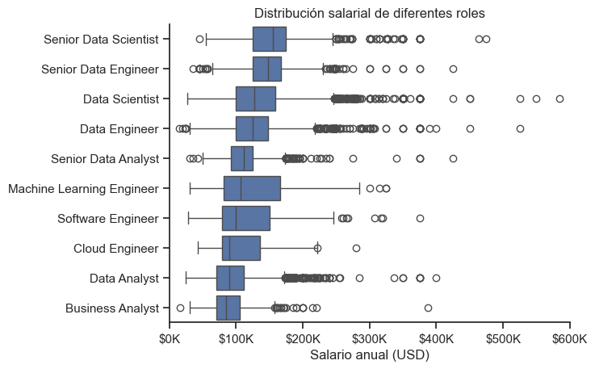

# 4. ¿Qué rango salarial ofrecen los roles mejor pagados?

Para acceder al documento con el código, [clicar aquí](P3.ipynb)

En esta sección analizaremos las distribuciones salariales para los 10 roles mejor pagados del sector.

Analizando la columna `salary_year_avg` observamos que algunas filas no contienen información (NaN). Para evitar que estos valores nulos afecten a nuestro estudio, eliminaremos todas las filas nulas con `dropna()`. 


Definimos `median_salary` de forma que, para cada rol, se nos indique su mediana salarial anual. Ordenamos y nos quedamos con los 10 roles con mayor mediana, creando una lista que nos servirá para filtrar el DataFrame, al cual llamaremos `filtered`. Hemos escogido calcular en base a la mediana y no a la media por la robustez frente a datos atípicos (*outliers*) que ofrece la primera. 


```
df = df.dropna(subset="salary_year_avg")
median_salary = df.groupby("job_title_short") ["salary_year_avg"].median().sort_values(ascending=False).head(10).index.tolist()
filtered = df[df["job_title_short"].isin(median_salary)]
``` 

Usaremos una *boxplot* para visualizar los datos, ya que nos permitirá identificar la dispersión salarial, comparar las medianas entre distintos roles y detectar visualmente la presencia de valores atípicos que podrían sesgar nuestro análisis.
```
sns.boxplot(data=filtered, x='salary_year_avg', y='job_title_short', order = median_salary)
sns.set_theme(style='ticks')
sns.despine()

plt.title('Salary Distributions of Data Jobs')
plt.xlabel('Yearly Salary (USD)')
plt.ylabel('')
plt.xlim(0, 600000) 
ticks_x = plt.FuncFormatter(lambda y, pos: f'${int(y/1000)}K')
plt.gca().xaxis.set_major_formatter(ticks_x)
plt.show()
```



La distribución salarial por roles confirma que el sector de los datos presenta una jerarquía económica muy marcada y una alta variabilidad en los puestos de mayor especialización. Los roles de nivel senior, particularmente Senior Data Scientist y Senior Data Engineer, lideran el mercado con las medianas salariales más altas, situándose consistentemente por encima de los $150K anuales. Por el contrario, perfiles como Data Analyst o Business Analyst muestran distribuciones más compactas y medianas cercanas a los $100K, lo que sugiere un mercado más estandarizado y con menor dispersión para estos puestos de entrada o de corte menos técnico.

Se observa la presencia masiva de *outliers* en la parte superior de la escala, especialmente en los perfiles de Data Scientist y Data Engineer, donde algunos salarios alcanzan los $600K. Aunque la mayoría de los profesionales se mueven en rangos predecibles, existe un segmento de élite con compensaciones excepcionales que, como anticipábamos al inicio, sesgan significativamente la media.

