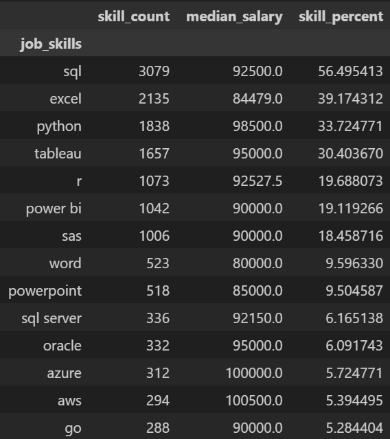

# ¿Cuál es la habilidad más óptima para los analistas de datos? 

Para acceder al documento con el código, [clicar aquí](p5.ipynb)

En esta sección estudiaremos qué habilidades son las más óptimas para un analista de datos, es decir, aquellas que presentan alta demanda y alta remuneración para este rol.

Como de costumbre, importamos librerías y preparamos el DataFrame.

```
dataset = load_dataset("lukebarousse/data_jobs")
df = dataset["train"].to_pandas()
df["job_skills"] = df["job_skills"].apply(lambda x: ast.literal_eval(x) if pd.notna(x) else x)
```
Queremos crear un DataFrame que nos indique, para cada habilidad, qué sueldo medio ofrece y en qué proporción respecto al total de puestos se demanda. De esta forma podremos filtrar por las habilidades más populares. 

Eliminamos las filas que no contienen datos de salario y filtramos por Data Analyst. Para poder estudiar las habilidades usamos `explode()` sobre la columna `job_skills`. 

```
df = df.dropna(subset="salary_year_avg")

df = df[df["job_title_short"] == "Data Analyst"]

df_exploded = df.explode("job_skills")
```
Creamos un nuevo DataFrame, `df_percentage`, con el recuento de cada habilidad y su sueldo medio. Escogeremos solamente aquellas habilidades que aparezcan en, al menos, el 5% de las ofertas. 

```
df_skills = df_exploded.groupby('job_skills')
['salary_year_avg'].agg(['count', 'median']).sort_values(by='count', ascending=False)

df_skills = df_skills.rename(columns={'count': 'skill_count', 'median': 'median_salary'})

total_skills = len(df["job_skills"])-1

df_skills["skill_percent"] = df_skills["skill_count"]*100/total_skills

df_percentage = df_skills[df_skills["skill_percent"] >= 5]``
```


Una buena forma de visualizar estos datos es con un diagrama de dispersión, donde veamos la correlación entre abundancia y sueldo para cada habilidad. Hacemos algunos ajustes para que la comprensión del diagrama sea más clara. Importamos `adjustText` para que las etiquetas de las habilidades no se solapen.

```
plt.scatter(df_percentage['skill_percent'], df_percentage['median_salary'])

plt.xlabel('Porcentaje de puestos de analista de datos')

plt.ylabel('Salario Medio ($USD)')  

plt.title('Habilidades más óptimas para un analista de datos')


ax = plt.gca()

ax.yaxis.set_major_formatter(plt.FuncFormatter(lambda y, pos: f'${int(y/1000)}K'))  


texts = []
for i, txt in enumerate(df_percentage.index):
    texts.append(plt.text(df_percentage['skill_percent'].iloc[i], df_percentage['median_salary'].iloc[i], " " + txt))

from adjustText import adjust_text

adjust_text(texts, arrowprops=dict(arrowstyle='->', color='gray'))

plt.show()
```


